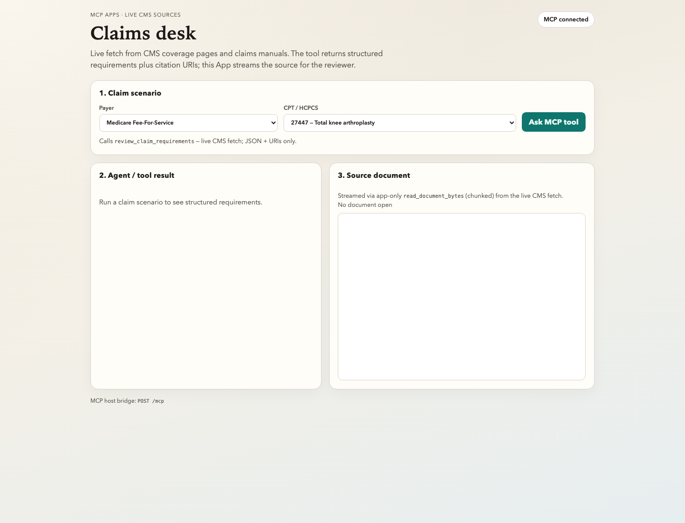
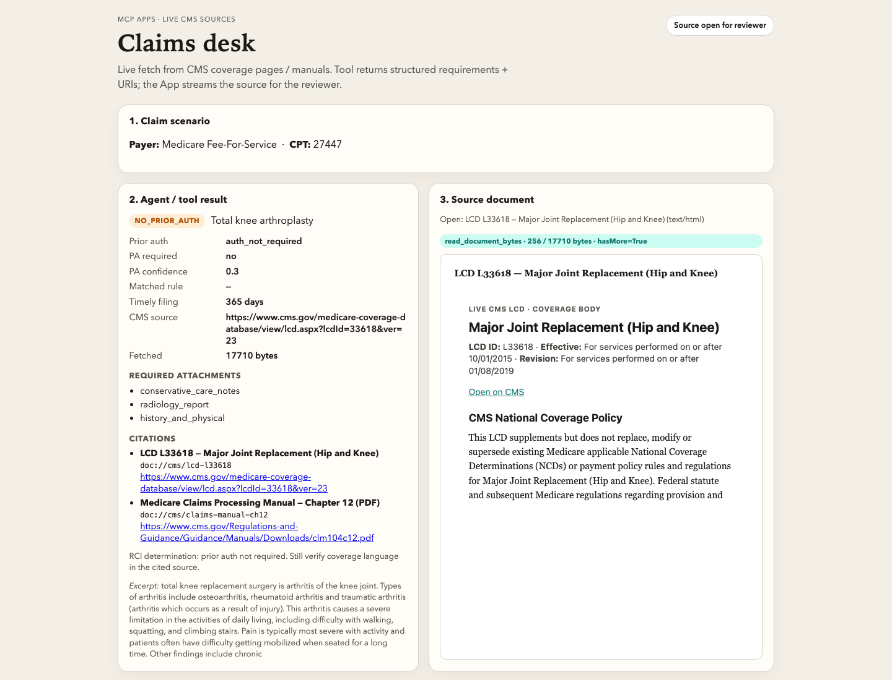
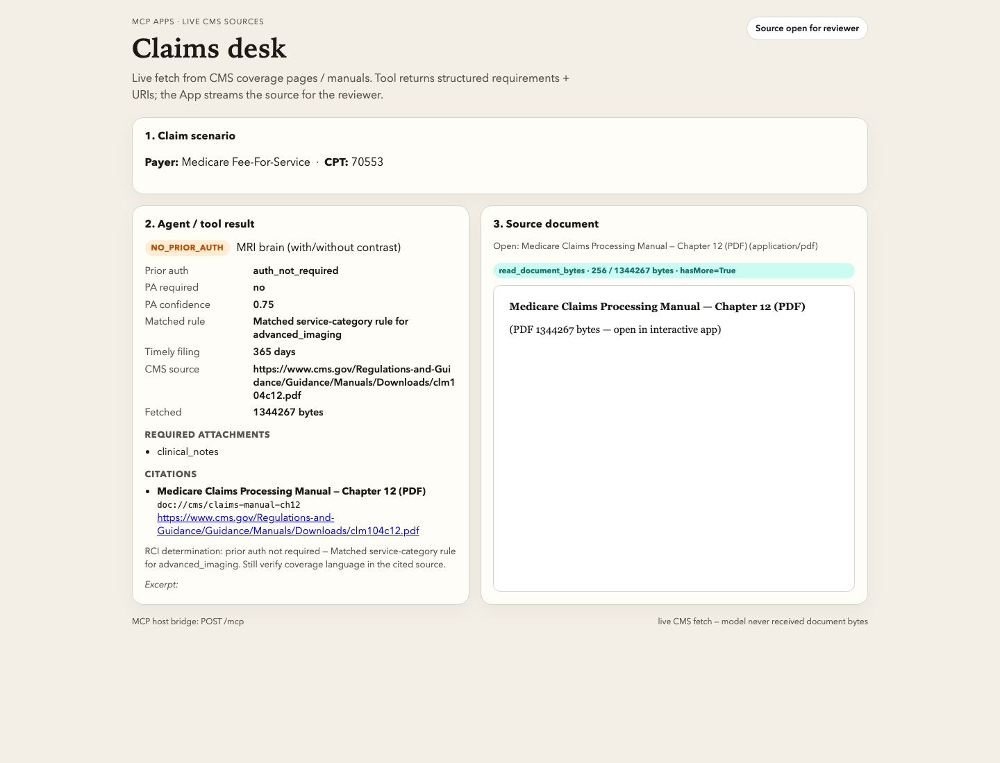
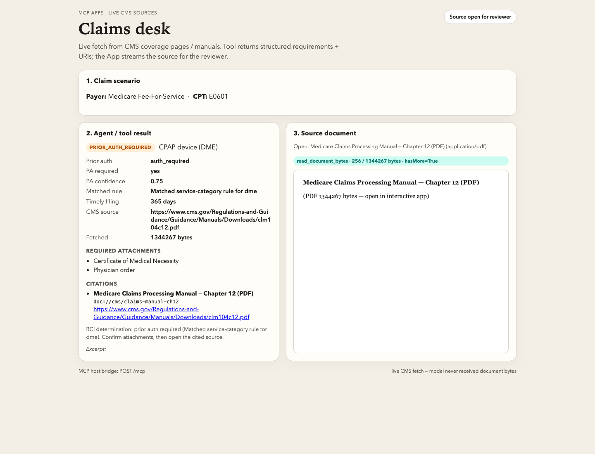
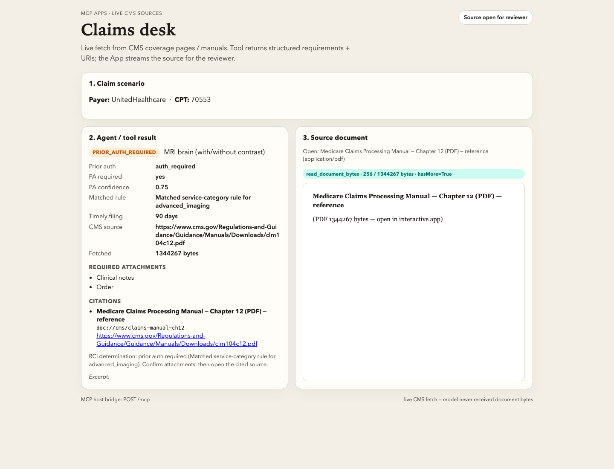

# Open the LCD. Then code the claim.
### A live CMS claims desk on MCP Apps — tools return URIs, the App streams the source

*Personal write-up by [Andrew Espira](https://github.com/espirado). Code: [mcp-resources-apps-demo](https://github.com/espirado/mcp-resources-apps-demo).*

---

Coding a knee replacement is the easy part. Confirming what Medicare actually expects in the chart — from a live LCD or claims manual — is the work.

I built a **claims desk** as an MCP App: pick Medicare + CPT **27447**, call one tool, get structured requirements and citation URIs, then stream the **live CMS source** into the reviewer panel. The first hit fetches CMS over HTTPS and caches locally; every later open is a chunked `read_document_bytes` stream into the UI.

With `RCI_API_KEY` set, the same tool enriches from live prior-auth / claim-intelligence against **`medicare_ffs`** (and UHC). MRI lands as `auth_not_required` (conf 0.75, category match); CPAP DME as `auth_required` with CMN + physician order; filing window 365 days.

## What you see

**Idle desk.** Medicare + UHC scenarios. One button: ask the MCP tool.



**TKA against live LCD L33618.** Structured requirements beside the coverage body (indications / limitations) — not the CMS page chrome.



**MRI (70553) — no prior auth** on Medicare FFS, category match at 0.75, 365-day filing, Claims Processing Manual citation.



**CPAP DME (E0601) — prior auth required**, with Certificate of Medical Necessity + physician order.



**Same CPT at UHC** flips to `auth_required` with clinical notes / order and a 90-day filing window.



## Implementation

```text
Analyst: Medicare + CPT
        │
        ▼
tools/call  review_claim_requirements
        │     HTTPS GET cms.gov (LCD HTML coverage body, or PDF)
        │     RCI prior-auth / claim-intelligence (medicare_ffs / uhc)
        │     returns JSON + doc:// URIs  (never document bytes)
        ▼
App UI
        ├─ render requirements
        └─ tools/call  read_document_bytes   ← app-only, chunked
                 └─ HTML / PDF pane for the reviewer
```

Resources expose the same library (`resources/list`, `resources/read`). Large manuals use the app-only chunked tool:

```json
"_meta": { "ui": { "visibility": ["app"] } }
```

Evidence runner proves the split: claim tool returns URIs only; reassembled chunks match `resources/read` byte-for-byte against the live fetch.

## Try it

```bash
git clone https://github.com/espirado/mcp-resources-apps-demo
cd mcp-resources-apps-demo
python3 scripts/serve_app.py
# → http://127.0.0.1:8765

# optional enrichment (auto-loads from .env if present)
# export RCI_API_KEY=...
# export RCI_API_URL=https://api-dev.rcintell.com
```

Pick **Medicare / 27447**, run the tool, open a citation. Watch a live CMS document land next to the structured result.

## Steal this

1. **Return citation URIs from tools** — not PDF/HTML bytes.
2. **Stream documents in the App** — that’s what reviewers need beside the answer.
3. **Fetch real sources** — CMS LCD coverage body and claims manuals here; wire your own APIs the same way.
4. **Keep the human in the loop** — the model proposes; the App shows the exhibit; the person decides.

The claim was never the hard part. Opening the right source document was. MCP Apps are how you put that source next to the answer.
