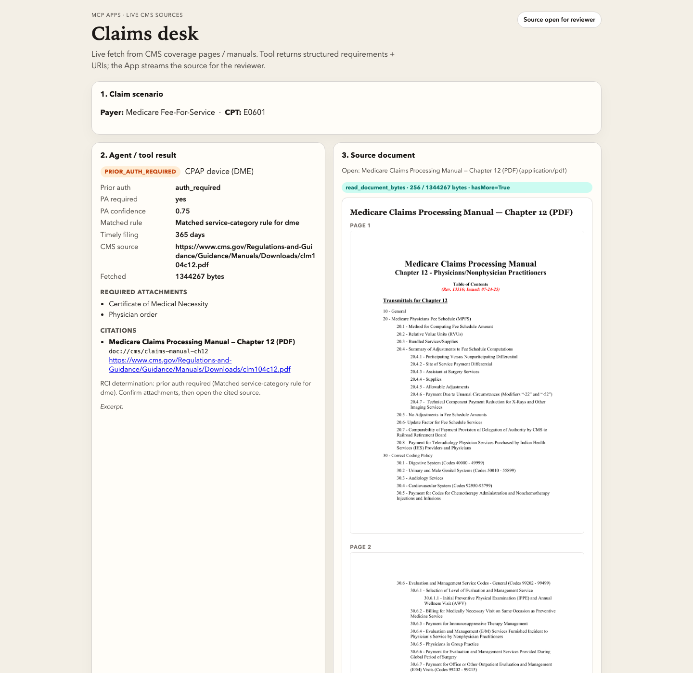

# The claim isn’t hard. The paperwork is.
### How MCP Apps keep payer policy PDFs next to the answer — without feeding them to the model

*Personal AAIF Ambassador write-up by [Andrew Espira](https://github.com/espirado). Demo: [mcp-resources-apps-demo](https://github.com/espirado/mcp-resources-apps-demo).*

---

It’s Monday morning in a hospital billing office.

On the screen: a knee replacement ready to drop. CPT **27447**. Payer: a commercial plan with a medical policy library that never seems to live in one place. Somewhere — portal A, drive B, last quarter’s email — there is a PDF that says whether elective joint replacement needs prior auth, what attachments belong on the claim, and how many days you have to file.

That hunt is the job.

Coding the line item takes minutes. **Finding and rereading the payer’s paperwork** takes the rest of the morning. Miss the documentation checklist and the claim comes back. Miss timely filing and it may never get paid. This is one of the hardest parts of medical billing and insurance operations: not the code tables, but the **scattered policies, PA grids, and source notices** humans still have to verify with their own eyes.

Agents are good at structured answers. They are bad roommates for 40-page PDFs. Stuff a policy notice into a tool result as base64 and you hit host size limits, burn the context window, and still leave a reviewer squinting at a wall of encoded bytes.

**MCP Apps** are how you split that work cleanly:

- the **agent / tool** returns *what to do* (status, PA, attachments, filing window) plus **citation URIs**
- the **App** fetches and **renders the source PDF** for the human
- the **model never has to eat the paperwork**

I built a small personal demo to make that story concrete: a **claims desk** UI wired to an MCP server.

## Scene 1 — The desk before the answer

The App opens on an empty claims desk. You pick a payer and a CPT, then call a single MCP tool. The copy on the page is the design intent out loud: JSON for the agent path, documents for the reviewer path.


This is the moment most “AI for RCM” demos skip. They return a paragraph of advice and hope the analyst trusts it. Real claims work doesn’t work that way. Advice without the policy page open is how denials happen.

## Scene 2 — A real claim: TKA at Acme Health

Scenario: **Acme Health**, CPT **27447** (total knee arthroplasty).

The MCP tool `review_claim_requirements` comes back with structured guidance:

- status **conditional**
- prior auth **required for elective**
- timely filing **90 days**
- required attachments: operative report, conservative-care notes, radiology report
- **citation URIs** into the orthopedic medical policy and the PA code grid

Then the App — not the model — opens the source policy via app-only `read_document_bytes` (chunked). On the right you see the actual notice: PA language, documentation checklist, filing window, coding notes that mention 27447.


That split is the whole product idea:

| Left panel (tool / agent) | Right panel (MCP App) |
|---------------------------|------------------------|
| Machine-readable requirements | Human-readable source of truth |
| Safe to reason over | Safe to verify against |
| No PDF bytes | PDF streamed in chunks |

The teal chip on the document pane (`chunk 0 · 256 / 1410 bytes · hasMore=true`) is intentional. It shows the App pulling paperwork through the protocol instead of pretending the model “read” the file.

## Scene 3 — Same pattern, different paperwork

Swap to **Northstar Mutual** and an MRI code (**70553**). Different payer, different manual, same choreography: tool → URIs → App opens the imaging utilization policy for the reviewer.



Billing teams don’t have one PDF problem. They have **hundreds**, per payer, per year, with effective dates that move. The protocol pattern has to survive that volume: always return handles, always render on demand, always keep bytes out of the prompt.

## What MCP is doing under the desk

```text
Analyst picks payer + CPT
        │
        ▼
tools/call  review_claim_requirements
        │     returns JSON + demo://policy URIs
        │     (no PDF bytes)
        ▼
App UI (claims desk)
        │
        ├─ show status / PA / attachments
        │
        └─ tools/call  read_document_bytes   ← app-only
                 chunked base64
                 └─ render beside the answer
```

Resources still matter: `resources/list` and `resources/read` expose the policy library and the Apps shell. For large manuals, the App prefers **chunked** `read_document_bytes` marked with:

```json
"_meta": { "ui": { "visibility": ["app"] } }
```

so hosts know those payloads are for the UI, not the assistant transcript.

I verified the path with a small evidence runner: the claim tool returns URIs only; reassembling the PDF across chunks matches `resources/read` byte-for-byte.

## Why this belongs in the MCP Apps conversation

AAIF’s MCP education track keeps asking developers to show **Apps** that do something a chat transcript can’t. Claims review is that something.

- **Tools** alone give you a chatbot with opinions about PA.
- **Resources** alone give you a file browser.
- **Apps** give you a **workstation**: answer + paperwork in one place, with the human still in the loop.

If you build agents for any document-heavy domain — insurance, compliance, procurement, clinical admin — the same story applies. The model proposes. The App shows the exhibit. The person decides.

## Try it

```bash
git clone https://github.com/espirado/mcp-resources-apps-demo
cd mcp-resources-apps-demo
python3 scripts/serve_app.py
# open http://127.0.0.1:8765
```

Pick **Acme Health / 27447**, click **Ask MCP tool**, open a citation. Watch the policy land next to the structured result.

## Honesty (because Ambassadors shouldn’t ship slop)

- Fixture payers and PDFs are **synthetic** — for teaching the pattern, not coverage advice.
- Protocol version in the demo is still `2024-11-05`.
- The local `POST /mcp` host is an Apps **spike**, not a full `@modelcontextprotocol/ext-apps` runtime.
- Production versions need allowlisted fetches, auth, and audit when you point at real payer manuals.

## What I want other builders to steal

1. **Don’t put PDFs in tool results.** Return citation URIs.
2. **Put paperwork in the App.** That’s what reviewers actually need.
3. **Chunk large documents** with an app-only tool when hosts have size limits.
4. **Tell a domain story.** MCP Apps land harder when the UI solves a job people already hate — like hunting payer policies before a claim goes out.

The claim was never the hard part. The paperwork was. MCP Apps are how we stop asking the model to swallow it.
